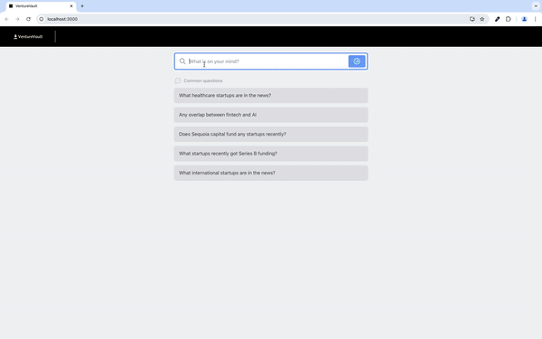

# VentureVault

VentureVault is your go-to source for reliable insights and the latest information on startups around the globe. By integrating Elasticsearch, Langchain, and OpenAI's LLM, it offers a sophisticated chatbot experience powered by Retrieval-Augmented Generation (RAG). Additionally, the application leverages the News API to update a sparse vector store with the latest news on startups, ensuring that users get the the most current and relevant information to their questions.

**Requires at least Elasticsearch 8.11.0.**



## Download the Project

Clone VentureVault to your local workspace.

```bash
git clone https://github.com/rahulnair2003/venture-vault.git
```

## Installing and Connecting to Elasticsearch

### Install Elasticsearch

```bash
docker run -p 9200:9200 -d --name elasticsearch \
  -e "discovery.type=single-node" \
  -e "xpack.security.enabled=false" \
  -e "xpack.security.http.ssl.enabled=false" \
  -e "xpack.license.self_generated.type=trial" \
  docker.elastic.co/elasticsearch/elasticsearch:8.13.0
```

### Connect to Elasticsearch

This app requires the following environment variables to be set to connect to the local Elasticsearch instance:

```sh
export ELASTICSEARCH_URL=http://localhost:9200
```

You should add these to a `.env` file for convenience. See the `env.example` file for a `.env` file template.


### Change the Elasticsearch index and chat_history index

By default, the VentureVault app will use the `venture-vault-docs` index and the chat history index will be `venture-vault-docs-chat-history`.

```sh
ES_INDEX=venture-vault-docs
ES_INDEX_CHAT_HISTORY=venture-vault-docs-chat-history
```

## Connecting to LLM

The app is configured to use OpenAI's LLM. To set it up, you need to provide the OpenAI API key via the `OPENAI_API_KEY` environment variable:

```sh
export LLM_TYPE=openai
export OPENAI_API_KEY=...
```

You can obtain your OpenAI key from the [OpenAI dashboard](https://platform.openai.com/account/api-keys).

## Setting Up the News API

VentureVault uses the News API to keep its vector store populated with the latest startup-related news. You need to set the following environment variable:

```sh
export NEWS_API_KEY=...
```

You can get your API key from the [News API website](https://newsapi.org/).

## Running the App

To simplify the process, you can use the provided build.sh script located in the top-level folder of the project. This script will handle all the necessary steps, including building the Docker image, setting up environment variables, and running the API and frontend.

Simply run:

```sh
./build.sh
```